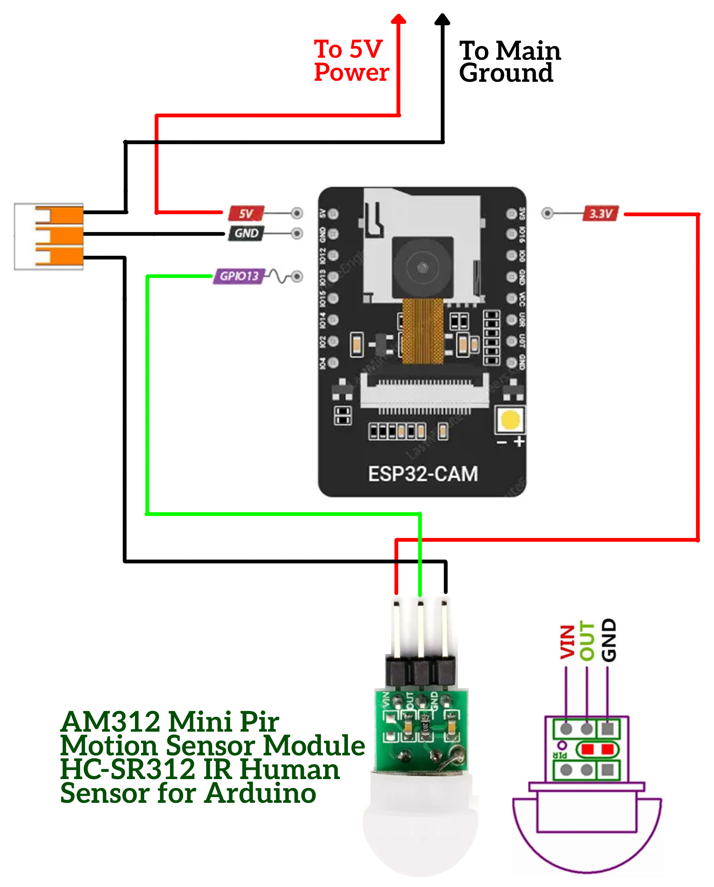
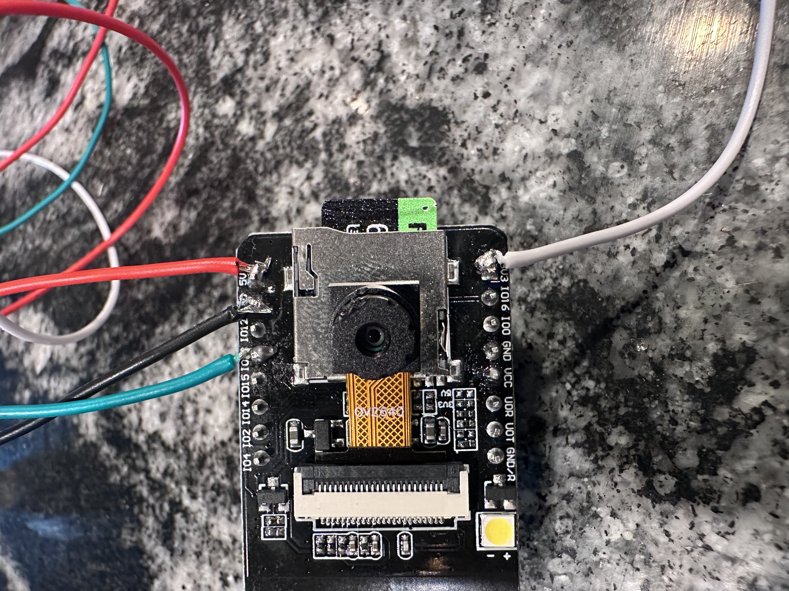
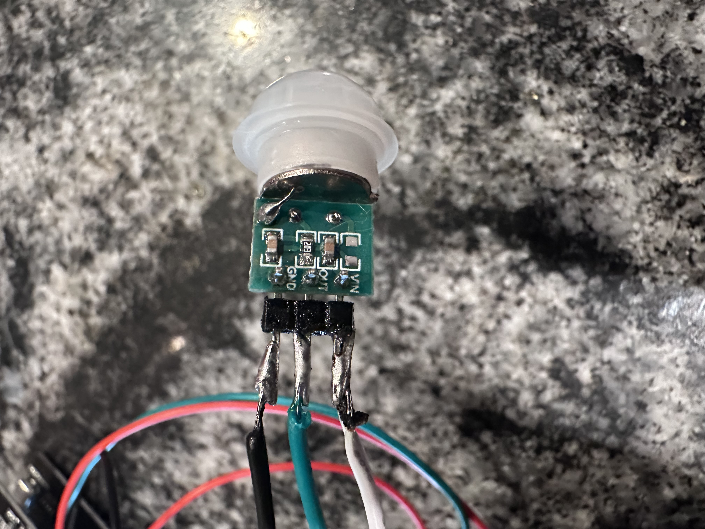

## What you’ll build

•	ESP32-CAM + PIR (AM312 on 3.3 V)

•	On motion: snap a photo → send to Telegram (push notification)

•  All photos saved to SD-Card

•	Optional always-on live MJPEG at http://ESP_IP:81/stream (link included in the alert)

________________________________________
## Build of Materials (BOM)


 AM312 Mini Pir Motion Sensor: [AMAZON](https://www.amazon.com/dp/B0CCF52DVJ?ref=ppx_yo2ov_dt_b_fed_asin_title)

 ESP32-CAM: [AMAZON](https://www.amazon.com/dp/B09TNVYSVJ?ref=ppx_yo2ov_dt_b_fed_asin_title&th=1)
 
 SD-card: [AMAZON] (https://a.co/d/fI8UoBN)

 22 AWG Stranded Wire Spool 10ft Each 6 Colors: [AMAZON](https://www.amazon.com/Fermerry-Stranded-Electric-Tinned-Copper/dp/B089CQHRDT/ref=sr_1_7?crid=2GENFHF7JIZXV&dib=eyJ2IjoiMSJ9.0is0xfeGIMj9TEgcksIBU__3upOqDWw9vCr0v4yDcFRDGgmZIh1RfEGxmx4d443HDgl4IMoyuXUxpHALQKDp-1K0eGIxJ4EH8w8N8Pj-KbJEz-CJDrLwbgz1nGTmPmzijX-vbVDUp6xXD3q_Zj5xjALyq5J4ntEAe6ufCPcrNzUxzSio8D6bPpZ3VuGFt8i7iCednutWgk9cAbfnt5AHHO98HLYrDkQQ9zAiaW1ItYZUKL7NbeLfjSsMLimtzBwbisJn77dJqpmkNJTOFWcrDLIMxpECXdxRrNA4LefZqds.rm7lcU3G7UGXkiRdzdBRH6ZJoUXJM6NbYI6V_V0X__0&dib_tag=se&keywords=electronics%2Bwire&qid=1758568191&sprefix=electroics%2Bwi%2Caps%2C308&sr=8-7&th=1)

________________________________________
## 🔑 Setting Up Telegram Bot & Chat ID

This project uses **Telegram** to send motion alerts. Follow these steps carefully — it only takes a few minutes.

---

### 1. Create a Telegram Bot with BotFather

1. Download, install and Open the **Telegram app** (desktop or mobile).  [Telegram download](https://desktop.telegram.org/)
2. Search for [@BotFather](https://t.me/botfather) and start a chat.  
   > BotFather is the official tool provided by Telegram to create and manage bots.  
3. Type the command:

   ```text
   /newbot
   ```

4. BotFather will ask for a **name** → choose something like `ESP32-CAM Notifier`.  
5. It will then ask for a **username** → this **must** end with `bot`.  
   Example: `esp32cam_alert_bot`.  
6. Once created, BotFather will reply with a message that includes your **Bot Token**:

   ```text
   Use this token to access the HTTP API:
   123456789:AAExampleTokenHere...
   ```

   🔑 Copy and save this **Bot Token**. You’ll paste it into your ESP32 code later:

   ```cpp
   #define TELEGRAM_TOKEN "123456789:AAExampleTokenHere"
   ```

---

### 2. Start Your Bot

1. Go back to Telegram.  
2. Search for your new bot by its username (e.g., `@esp32cam_alert_bot`).  
3. Open the chat and press **Start**.  
   > This activates the bot so it can receive and send messages.

---

### 3. Get Your Chat ID

Your ESP32 code also needs your **numeric chat ID**.

**Option A (fastest):**
1. Forward **any message** from your bot chat to [@userinfobot](https://t.me/userinfobot).  
2. It will reply with your numeric `chat_id`.  

**Option B (alternative):**
1. Start a chat with [@getidsbot](https://t.me/getidsbot).  
2. Send `/start`, and it will display your `chat_id`.  

Example response:

```text
Your user ID: 987654321
```

🔑 Copy that number into your ESP32 code:

```cpp
#define TELEGRAM_CHAT_ID "987654321"
```

---

### 4. Verify Setup

At this point you should have:
- `TELEGRAM_TOKEN` → from BotFather  
- `TELEGRAM_CHAT_ID` → from userinfobot/getidsbot  

✅ Once uploaded, the ESP32 will use these to send you motion-triggered photos.

---
________________________________________

## 🛠️ Installing & Uploading the Code to ESP32-CAM

Follow these steps to download the Arduino IDE, install the ESP32 board support, and upload the provided `Cat_feeder_camera.ino` sketch.

---

### 1. Download Arduino IDE

1. Visit the official Arduino download page:  
   👉 [https://www.arduino.cc/en/software/](https://www.arduino.cc/en/software/)  
2. Download the version for your operating system (Windows, macOS, or Linux).  
3. Install Arduino IDE following the on-screen prompts.

---

### 2. Install ESP32 Board Package

1. Open **Arduino IDE**.  
2. Go to **File → Preferences**.  
3. In the **Additional Board Manager URLs** field, paste the following URL:

   ```
   https://raw.githubusercontent.com/espressif/arduino-esp32/gh-pages/package_esp32_index.json
   ```

4. Click **OK**.  
5. Go to **Tools → Board → Board Manager**.  
6. Search for **esp32** and install **"esp32 by Espressif Systems"**.  
   > This will add ESP32-CAM support to the IDE.

---

### 3. Download the Sketch from Repository

1. Navigate to this GitHub repository.  
2. Locate the file: **`Cat_feeder_camera.ino`**.  
3. Click **Download raw file** or **Clone the repository** and open the file in Arduino IDE.
4. Make sure to update the USER CONFIG at the top with your WIFI settings and Telegram settings:

#define WIFI_SSID       "ENTER YOUR WIFI SSID"
#define WIFI_PASS       "ENTER YOU WIFI PASSWORD"
#define TELEGRAM_TOKEN  "ENTER YOUR TELEGRAM TOKEN"   // from BotFather
#define TELEGRAM_CHATID "ENTER YOUR CHAT ID"             // your numeric chat id from Get ID bot  

---

### 4. Select the Correct Board & Port

1. In Arduino IDE, go to **Tools → Board → ESP32 Arduino → AI Thinker ESP32-CAM**  
   > If you’re using a USB-equipped ESP32-CAM board, select the correct variant if it appears.  
2. Go to **Tools → Port** and select the COM port associated with your ESP32-CAM.  
3. Set **Upload Speed** to `115200`.
4. Install SD card - the SD Card is to store the photos after they are taken to a sibgle file.
---

### 5. Connect ESP32-CAM for Flashing

- **If your ESP32-CAM has onboard USB** → connect directly via USB-C or Micro-USB.  
- **If not** → use an FTDI programmer:  
  - Connect **5V → 5V**, **GND → GND**, **U0R → TX**, **U0T → RX**.  
  - Pull **IO0 → GND** for flashing mode.  

---

### 6. Upload the Code

1. Click the **✓ Verify** button to compile the sketch.  
2. Click the **→ Upload** button.  
3. If using a manual board (without auto bootloader, although most come with it):  
   - Hold down the **BOOT (IO0)** button, press **RST**, release **BOOT** after upload begins.  
4. Wait for **"Done Uploading"** message in Arduino IDE.

---

### 7. Open Serial Monitor

1. Go to **Tools → Serial Monitor**.  
2. Set baud rate to **115200**.  
3. The ESP32-CAM will display its IP address and confirm successful boot.

✅ Your ESP32-CAM is now running `Cat_feeder_camera.ino`!

   
________________________________________
## 🛠️ Wiring (USB-equipped ESP32-CAM)
•	USB-C/Micro-USB → ESP32-CAM (for power + flashing)
•	PIR VCC → 3.3 V (AM312) | PIR GND → GND | PIR OUT → GPIO 13

Use the deigram below (ignore my shoddy soldering job):







________________________________________

That is all, Now all you have to do is install it into your cat feeder how you see fit. 


